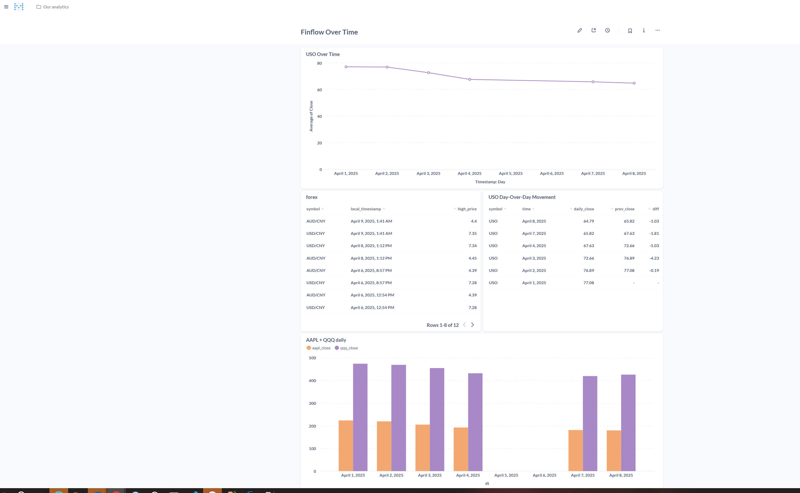
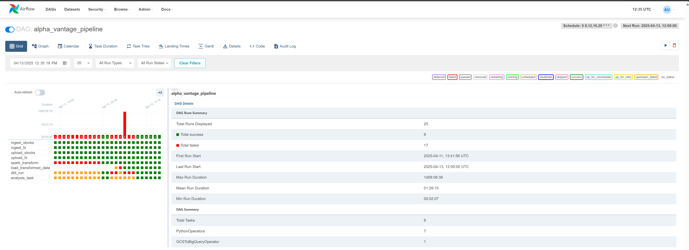
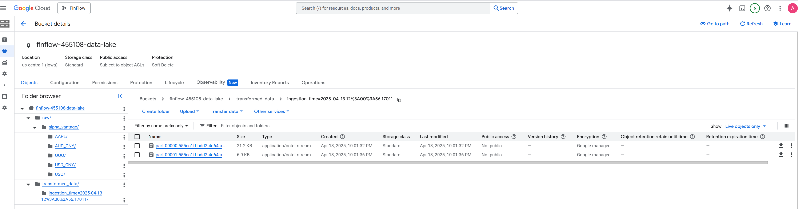
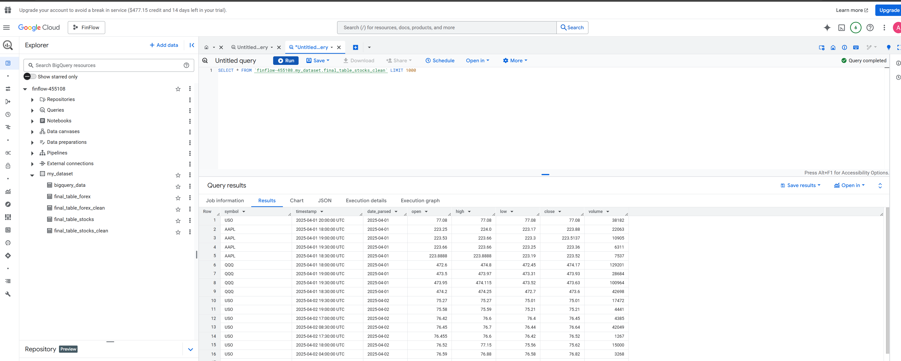

# FinFlow Data Pipeline

A streamlined pipeline for Alpha Vantage financial data, orchestrated via Airflow, processed with Spark, stored in BigQuery, modeled with DBT, and visualized in Metabase.

---

## Final Dashboard

- **Link**: [Metabase Dashboard](http://glorious-broccoli-x5pv7rg9gp4g3vxq4-3000.app.github.dev/public/dashboard/c0e448a2-17d9-475e-b92b-ab8a1d0c0de5 ) The link only works when Metabase is actively running docker-compose up

---

## 1. Problem Description

Recent fluctuations in both **stock** and **foreign exchange** rates (especially the **AUD/CNY** pair) often leave **me** guessing if it’s truly the right time to make a move. Relying on real-time banking exchange quotes alone can be frustrating, as it’s not easy to see longer trends or historical lows.

Hence, this project aims to build a **scalable pipeline** that:

- **Orchestrates** the entire workflow with **Airflow**.
    
- **Extracts** market data from **Alpha Vantage**.
- **Lands** raw CSV files in **Google Cloud Storage (GCS)**.
    
- **Transforms** those files using **Spark** (batch processing) and **dbt** (final cleaning and deduplication).
- **Loads** the refined tables into **BigQuery**.
    
- **Visualizes** currency movements (AUD/CNY, USD/CNY) and stock/ETF performance (USO, AAPL, QQQ) in **Metabase**.

---

## 2. Project Structure

```
FinFlow
├── credentials/                  # Contains service account key.json (excluded from Git)
│   └── key.json
├── dags/
│   └── alpha_vantage_pipeline.py # Main Airflow DAG
├── dbt/
│   ├── dbt_packages/
│   ├── logs/
│   ├── models/
│   │   ├── dedup_forex.sql
│   │   ├── dedup_stocks.sql
│   ├── sources.yml              
│   ├── dbt_project.yml
│   ├── profiles.yml
│   └── target/
├── images/
│   └── finflow.png             # screenshot for Metabase
├── logs/                         # Airflow logs or custom logs
├── metabase-data/               # Metabase persistent data
├── plugins/
├── postgres-data/               # Postgres persistent data
├── src/
│   ├── alpha_vantage_api.py
│   ├── ingest_forex.py
│   ├── ingest_stock.py
│   ├── transform_data.py        # Spark job to unify + transform data
│   └── upload_gcs.py            # helper for uploading DataFrame to GCS
├── terraform/
│   ├── main.tf
│   ├── variables.tf
│   └── outputs.tf
├── .env                          # environment variables
├── .gitignore
├── docker-compose.yml            # Defines services: Airflow, Spark, Metabase, Postgres
├── Dockerfile_airflow            # Custom Airflow image
├── Dockerfile_spark              # Custom Spark image
├── requirements.txt              # Python dependencies
└── README.md                     # This file

```
## 3. Deployment & Execution

### Prerequisites

- **Docker & Docker Compose**
- **Google Cloud** project with a BigQuery dataset & GCS bucket
- **Alpha Vantage API key**

### Steps

1. **Clone the Repo**
    
    ```bash
    git clone https://github.com/.../finflow.git
    
    ```
    
2. **Create an `.env` file** with real values:
    
    ```bash
    ALPHA_VANTAGE_API_KEY=YOUR_REAL_KEY
    GCP_PROJECT_ID=your-project
    GCP_DATASET_ID=my_dataset
    DATA_LAKE_BUCKET=your-gcs-bucket
    
    ```
    
3. **GCP Credentials**
    - Place your service account key (e.g. `key.json`) in `credentials/` and configure Docker/Airflow as needed.
4. **Build & Run**
    
    ```bash
    docker-compose build
    docker-compose up -d
    
    ```
    
    This launches Airflow (webserver + scheduler), Spark, Metabase, and Postgres.
    
5. **Airflow**
    - Access [http://localhost:8080](http://localhost:8080/) (default user: `admin`, pass: `admin`).
    - Turn on the `alpha_vantage_pipeline` DAG.
    - Trigger a run or wait for its schedule.
    ⚠️ Note: The first login might fail. If so, click to go back and try again—it should work.

---

## 4. Viewing Dashboard (Metabase)

1. **Metabase**
    - Go to [http://localhost:3000](http://localhost:3000/)(default user: `20250107@gmail.com`, pass: `200758573`).

2. **Explore Final Tables**
    - Find **`final_table_stocks_clean`** and **`final_table_forex_clean`**.

---

---


