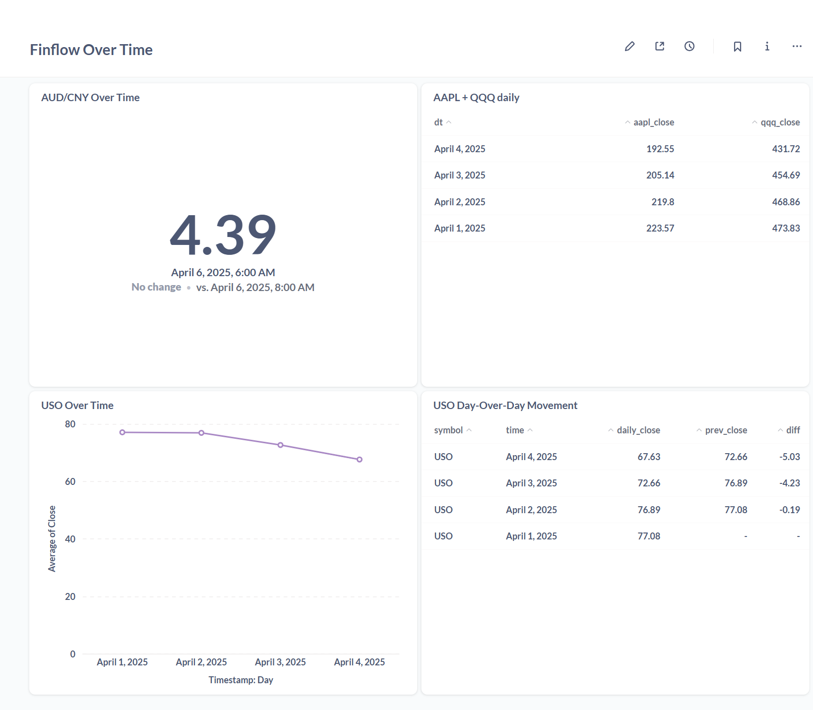

# FinFlow Data Pipeline

A data engineering project using **Alpha Vantage** APIs, **Airflow**, **Spark**, **dbt**, and **BigQuery** to ingest, transform, and analyze financial data—such as **Forex** (AUD/CNY, USD/CNY) and **stocks** (AAPL, QQQ, USO). This pipeline stores raw data in GCS, processes it via Spark/dbt, and loads deduplicated, final tables into BigQuery for analytics. A **Metabase** dashboard can then visualize insights.

---

## Final Dashboard

- **Link**: [Metabase Dashboard](https://glorious-broccoli-x5pv7rg9gp4g3vxq4-3000.app.github.dev/public/dashboard/c0e448a2-17d9-475e-b92b-ab8a1d0c0de5) The link only works when Metabase is actively running docker-compose up

---

## 1. Problem Description

Recent fluctuations in both **stock** and **foreign exchange** rates (especially the **AUD/CNY** pair) often leave **me** guessing if it’s truly the right time to make a move. Relying on real-time banking exchange quotes alone can be frustrating, as it’s not easy to see longer trends or historical lows.

Hence, this project aims to build a **scalable pipeline** that:

1. **Schedules and Orchestrates** the workflow with **Airflow**.
2. **Extracts** data from **Alpha Vantage**.
3. **Stores** raw CSVs in **Google Cloud Storage (GCS)**.
4. **Transforms** them using **Spark** (batch processing) and **dbt** (for final cleaning/deduplication).
5. **Loads** final tables into **BigQuery**.
6. **Visualizes** the results in **Metabase** for insights on currency movements (AUD/CNY, USD/CNY) and stock/ETF performance (USO, AAPL, QQQ).

---

## 2. Project Structure

```
FinFlow
├── credentials/                  # Contains service account key.json (excluded from Git)
│   └── key.json
├── dags/
│   └── alpha_vantage_pipeline.py # Main Airflow DAG
├── dbt/
│   ├── dbt_packages/
│   ├── logs/
│   ├── models/
│   │   ├── dedup_forex.sql
│   │   ├── dedup_stocks.sql
│   ├── sources.yml               # dbt sources referencing 'transformed_data' or older final tables
│   ├── dbt_project.yml
│   ├── profiles.yml
│   └── target/
├── images/
│   └── Metabase.png             # screenshot for README
├── logs/                         # Airflow logs or custom logs
├── metabase-data/               # Metabase persistent data
├── plugins/
├── postgres-data/               # Postgres persistent data
├── src/
│   ├── alpha_vantage_api.py
│   ├── ingest_forex.py
│   ├── ingest_stock.py
│   ├── transform_data.py        # Spark job to unify + transform data
│   └── upload_gcs.py            # helper for uploading DataFrame to GCS
├── terraform/
│   ├── main.tf
│   ├── variables.tf
│   └── outputs.tf
├── .env                          # environment variables
├── .gitignore
├── docker-compose.yml            # Defines services: Airflow, Spark, Metabase, Postgres
├── Dockerfile_airflow            # Custom Airflow image
├── Dockerfile_spark              # Custom Spark image
├── requirements.txt              # Python dependencies
└── README.md                     # This file

```

---

---


